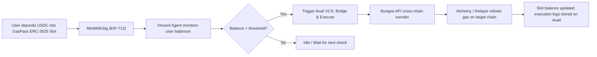

### GasPass

｜GasPass — An ERC-3525-based stored-value “gas card” that automatically or manually refuels gas across multiple EVM chains.

---
## 📑 Table of Contents

Overview

Architecture

Features

Smart Contract

Tech Stack

How It Works

Deployment

Integrations

Roadmap

License

---

## 🚀 Overview
Category	Description
Type	ERC-3525 Semi-Fungible Token (SFT)
Purpose	A stored-value gas card for multi-chain gas refueling
Core Concept	Users deposit USDC into an ERC-3525 slot; Vincent Agent automates gas top-ups when balances drop below threshold
Key Technologies	Lit Protocol, Avail XCS, Bungee Bridge API, Alchemy Gas Manager, EIP-712, Permit2
Status	Cross-chain prototype deployed on Arbitrum & Base testnets

---

## 🧠 Architecture




---
## ⚙️ Features

| Feature                  | Description                                                                            |
| ------------------------ | -------------------------------------------------------------------------------------- |
| **ERC-3525 Gas Slot**    | Each slot acts as a semi-fungible “gas wallet” holding USDC/USDT for a specific chain. |
| **Permit-Based Minting** | Supports EIP-712 + ERC-20 Permit2 signatures for gasless onboarding.                   |
| **Vincent Agent (PKP)**  | Automated delegated execution powered by Lit Protocol’s Vincent Abilities.             |
| **Cross-Chain Refuel**   | Uses Avail’s Bridge & Execute and Bungee API for intent-based stablecoin transfers.    |
| **Alchemy Gas Manager**  | Sponsors or triggers gas top-ups via paymaster API.                                    |
| **Unified Slot Balance** | Slot states and refuel logs recorded on Avail for verifiable auditing.                 |

---

## 🧩 Smart Contract

Contract: GasPass.sol
Standards: ERC-3525 + EIP-712 + Permit2

Key Components
| Module              | Functionality                                             |
| ------------------- | --------------------------------------------------------- |
| `MintWithSig`       | Mints a new ERC-3525 token with user signature (EIP-712). |
| `DepositWithSig`    | Deposits USDC/USDT via Permit2 authorization.             |
| `SetRefuelPolicy`   | Defines threshold, chain target, and trigger conditions.  |
| `ExecuteRefuel`     | Called by Vincent Agent once the policy condition is met. |
| `UpdateSlotBalance` | Updates slot’s on-chain value and Avail audit log.        |

---

## 🛠️ Tech Stack
| Layer                 | Tools & Frameworks                             |
| --------------------- | ---------------------------------------------- |
| **Smart Contracts**   | Solidity, Foundry, OpenZeppelin, Solv ERC-3525 |
| **Cross-Chain Layer** | Avail XCS, Bungee Bridge API                   |
| **Automation Layer**  | Lit Protocol Vincent Abilities (PKP Agent)     |
| **Frontend**          | Vue 3, Vite, Vuetify, Pinia, Viem, Ethers.js   |
| **Backend / Infra**   | Node.js, Express, Alchemy SDK, Avail SDK       |

---
## 🔄 How It Works

1. User Deposit
Users deposit USDC into an ERC-3525 slot using MintWithSig.

2. Threshold Monitoring
The Vincent Agent (Lit PKP) monitors target chain gas balances.

3. Auto Refuel Trigger
When the balance drops below a set threshold, the agent triggers an Avail XCS intent.

4. Cross-Chain Execution
Avail executes through Bungee, bridging stablecoins securely.

5. Gas Top-Up
Alchemy Gas Manager or relayer converts bridged tokens to gas and funds the destination wallet.

6. Balance Sync
Updated balances and execution logs are stored on Avail.

---

## 🧱 Deployment
```bash
# Clone repository
git clone https://github.com/<your-username>/GasPass.git
cd GasPass

# Install dependencies
pnpm install

# Compile contracts
forge build

# Deploy to Arbitrum
forge script script/DeployGasPass.s.sol:DeployGasPass \
  --rpc-url $ARBITRUM_RPC \
  --broadcast
```
---

## 🔗 Integration Examples

Lit Protocol
Automates ExecuteRefuel using delegated policy execution via Vincent Agent.

Avail SDK
Submits cross-chain intents (Bridge & Execute) and maintains proof logs.

Alchemy Gas Manager
Sponsors gas on Arbitrum/Base via paymaster integration.

---
## 🧭 Future Roadmap
Phase	Goal
🔹 Phase 1	ERC-3525 base contract + manual refuel;
🔹 Phase 2	Automated refuel via Vincent Agent (Lit PKP);
🔹 Phase 3	Avail XCS integration (Bridge & Execute)
🔹 Phase 4	Multi-chain dashboard + analytics;
🔹 Phase 5	Public launch + staking incentives;

---
## 📜 License

MIT License © 2025 GasPass Contributors
